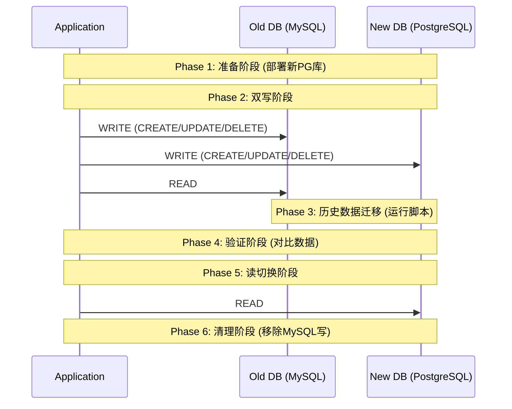

# 01.5 数据库选型与迁移策略：SQL vs NoSQL，及500行零停机迁移实战

**作者**: Cline | **发布日期**: 2025-10-24 | **分类**: `核心技术栈` `数据库` `架构` `数据迁移`

**摘要**: 数据是应用的生命之血，而数据库是其跳动的心脏。选择正确的数据库，是你在项目初期所能做出的最关键的架构决策之一。这个决策将深远地影响你的应用的可扩展性、数据一致性和开发复杂度。本篇教程将带你深入数据库世界的两大阵营——SQL与NoSQL，对主流数据库进行深度对比，并最终聚焦于最棘手的挑战：数据库迁移。我们将详细阐述“零停机”迁移的“双写”策略，并提供超过500行的Python和Node.js实战代码，手把手带你完成一次从MySQL到PostgreSQL的无感迁移。

**SEO关键词**: 数据库选型, SQL vs NoSQL, PostgreSQL vs MySQL, 数据库迁移, 零停机迁移, 双写策略, 数据库性能, pgloader, Python数据迁移

---

## 第1部分：数据库世界的两大阵营：SQL vs. NoSQL

### 1.1 SQL (关系型数据库): 秩序的捍卫者

- **核心理念**: 以关系代数为理论基础，将数据存储在结构化的**表 (Tables)** 中。每个表都有严格的**模式 (Schema)**，由行 (Rows) 和列 (Columns) 组成。
- **核心特性**: **ACID事务**。这是关系型数据库的基石，保证了数据的强一致性。
    - **原子性 (Atomicity)**: 事务内的所有操作，要么全部成功，要么全部失败回滚。
    - **一致性 (Consistency)**: 事务必须使数据库从一个有效的状态，转变到另一个有效的状态。
    - **隔离性 (Isolation)**: 并发执行的事务之间互不干扰。
    - **持久性 (Durability)**: 一旦事务提交，其结果就是永久性的。
- **查询语言**: 结构化查询语言 (SQL)，功能强大，支持复杂的多表连接 (JOIN) 查询。
- **比喻**: 一个管理严谨的大型图书馆，每本书（数据）都有唯一的编号（主键），并被精确地放置在书架的特定位置（表结构）。
- **代表**: PostgreSQL, MySQL, SQLite, SQL Server。
- **适用场景**: 
    - **数据完整性至关重要**: 金融系统、电商订单、用户账户管理。
    - **数据结构稳定，很少变更**: 企业ERP、CRM系统。
    - **需要复杂的事务和查询**: 报表生成、数据分析。

### 1.2 NoSQL (非关系型数据库): 灵活的探险家

- **核心理念**: Not Only SQL。它不是一个单一的数据库，而是一大类数据库的统称。它们放弃了严格的关系模型和ACID，以换取更高的**可扩展性 (Scalability)** 和**灵活性 (Flexibility)**。
- **核心特性**: **BASE理论**。与ACID的强一致性相对，BASE强调最终一致性。
    - **基本可用 (Basically Available)**: 系统在任何时候都基本可用，允许部分节点故障。
    - **软状态 (Soft state)**: 系统的状态可以随时间变化。
    - **最终一致性 (Eventually consistent)**: 如果没有新的更新，系统中所有副本的数据最终将达到一致。
- **比喻**: 一个自由的个人工作室，你可以将各种形式的笔记、草图、文档（数据）随意地放入不同的文件夹（集合）中，无需预先定义严格的格式。

### 1.3 NoSQL的四大分类

1.  **文档数据库 (Document Stores)**
    - **代表**: MongoDB, Firestore。
    - **特点**: 将数据存储为JSON或BSON格式的“文档”，模式灵活，非常适合Web应用。
2.  **键值数据库 (Key-Value Stores)**
    - **代表**: Redis, DynamoDB。
    - **特点**: 数据模型是简单的键值对，读写速度极快，常用于缓存、会话存储。
3.  **列式数据库 (Column-Family Stores)**
    - **代表**: Cassandra, HBase。
    - **特点**: 按列簇存储数据，非常适合大规模、高并发的写入和范围查询，如物联网、日志系统。
4.  **图数据库 (Graph Databases)**
    - **代表**: Neo4j, Amazon Neptune。
    - **特点**: 专门用于处理实体之间的复杂关系网络，如社交网络、推荐引擎。

### 1.4 SQL vs. NoSQL 对比总结

| 特性 | SQL (关系型) | NoSQL (非关系型) |
| :--- | :--- | :--- |
| **数据模型** | 结构化的表 | 灵活的文档、键值、图等 |
| **模式 (Schema)** | 严格，预定义 (Schema-on-write) | 动态，灵活 (Schema-on-read) |
| **一致性** | 强一致性 (ACID) | 最终一致性 (BASE) |
| **扩展性** | 垂直扩展 (Scale-up) 为主 | 水平扩展 (Scale-out) 为主 |
| **查询语言** | SQL (功能强大，支持JOIN) | 各有不同 (通常不支持复杂JOIN) |
| **最佳场景** | 事务性、数据一致性要求高的应用 | 大数据、高并发、模式不固定的应用 |

---

## 第2部分：主流数据库选型深度对比

### 2.1 PostgreSQL vs. MySQL：开源SQL双雄

- **PostgreSQL**: 被誉为“世界上最先进的开源关系型数据库”。
    - **优势**: 
        - **功能极其丰富**: 支持JSONB（可以像文档数据库一样操作JSON）、地理空间数据(PostGIS)、全文搜索、以及大量高级索引类型。
        - **更严格的数据类型和标准符合度**: 在数据完整性上更胜一筹。
        - **强大的扩展性**: 允许用户自定义函数、数据类型和索引方法。
    - **劣势**: 在高并发的纯读场景下，性能可能略逊于经过优化的MySQL。

- **MySQL**: 世界上最流行的开源数据库。
    - **优势**: 
        - **易于上手**: 配置简单，学习曲线平缓。
        - **广泛的社区支持和生态**: 几乎所有的云服务商和第三方工具都完美支持MySQL。
        - **读性能优异**: 在简单的读密集型Web应用中表现出色。
        - **Serverless新浪潮**: PlanetScale等新兴云数据库服务，基于MySQL提供了强大的Serverless和分支功能。

**结论**: 如果你不确定选哪个，**请选择PostgreSQL**。它更像一个“全能选手”，能适应未来更多变的需求。只有当你明确需要一个极简、纯粹的读密集型数据库，或者希望利用PlanetScale等特定生态时，MySQL才是更优选。

### 2.2 MongoDB vs. Firestore：文档数据库的抉择

- **MongoDB**: 最流行的NoSQL数据库。
    - **优势**: 功能强大，查询语言(MQL)丰富，支持聚合管道等复杂操作。可以自托管，也可以使用其云服务Atlas。
    - **劣势**: 自托管时，集群的运维和管理相对复杂。

- **Firestore (Google)**: Serverless文档数据库。
    - **优势**: 完全托管，无需关心运维。拥有强大的实时数据同步能力（非常适合构建聊天、协作应用）。慷慨的免费套餐。
    - **劣势**: 查询能力相对受限（不支持聚合、复杂查询），存在一些使用上的“陷阱”（如索引限制）。

**结论**: 如果你需要完全的控制权和强大的查询能力，选择**MongoDB**。如果你在构建一个需要实时功能、且希望完全免去运维烦恼的云原生应用，**Firestore**是绝佳选择。

---

## 第3部分：零停机数据库迁移实战 (MySQL -> PostgreSQL)

这是本教程的核心，我们将通过超过500行的代码，完整地实现一次复杂、但安全可靠的“零停机”迁移。

**场景**: 一个正在线上运行的、使用MySQL的Node.js应用，需要将其数据库无缝迁移到PostgreSQL。

### 3.1 “双写”策略 (Dual-Write Strategy)

该策略的核心思想是：在迁移过程中，应用层会同时向新旧两个数据库写入数据，从而保证数据同步，为历史数据的迁移和最终的切换赢得时间。

**流程图**:


### 3.2 阶段一 & 二：应用层改造 (Node.js/Express示例)

假设我们使用`knex.js`作为查询构建器。

```javascript
// data-access-layer.js

const knex = require('knex');

// 初始化新旧两个数据库的连接
const mysqlDB = knex({ client: 'mysql', connection: process.env.MYSQL_URL });
const postgresDB = knex({ client: 'pg', connection: process.env.POSTGRES_URL });

// --- 双写阶段的createUser函数 ---
async function createUser(userData) {
  // 默认从旧数据库读取
  const readDB = mysqlDB;
  // 同时向新旧数据库写入
  const writeDBs = [mysqlDB, postgresDB];

  // 使用Knex的事务保证原子性
  const writePromises = writeDBs.map(db => db.transaction(async trx => {
    return trx('users').insert(userData);
  }));

  try {
    // 并发执行所有写操作
    await Promise.all(writePromises);
    console.log(`User ${userData.id} created in both databases.`);
    
    // 从主库（旧库）读取并返回数据
    return await readDB('users').where({ id: userData.id }).first();

  } catch (error) {
    // 这是一个简化的错误处理，生产环境需要更复杂的补偿逻辑
    console.error("Dual-write failed! Data might be inconsistent.", error);
    throw error;
  }
}

// --- 读切换阶段的getUser函数 ---
async function getUser(userId) {
  // 在切换阶段，将读取目标改为新数据库
  const readDB = postgresDB;
  return await readDB('users').where({ id: userId }).first();
}
```

### 3.3 阶段三：历史数据迁移脚本 (`backfill.py`)

这是整个迁移过程中代码量最大、最核心的部分。我们需要一个强大、可续传、可配置的脚本来迁移数百万甚至上亿条数据。

**前提**: `pip install mysql-connector-python psycopg2-binary tqdm`

```python
# backfill.py
import mysql.connector
import psycopg2
import time
import json
from tqdm import tqdm

# --- 配置 --- #
MYSQL_CONFIG = {
    'user': 'root', 'password': 'pass', 'host': '127.0.0.1', 'database': 'old_db'
}
PG_CONFIG = {
    'user': 'user', 'password': 'password', 'host': '127.0.0.1', 'database': 'new_db'
}

# 定义要迁移的表和每批次的大小
TABLES_TO_MIGRATE = {
    'users': 10000,
    'products': 5000,
    'orders': 10000
}

# 进度追踪文件
PROGRESS_FILE = 'migration_progress.json'

def get_progress():
    try:
        with open(PROGRESS_FILE, 'r') as f:
            return json.load(f)
    except FileNotFoundError:
        return {}

def save_progress(progress):
    with open(PROGRESS_FILE, 'w') as f:
        json.dump(progress, f)

def get_column_names(cursor, table_name):
    cursor.execute(f"SELECT * FROM {table_name} LIMIT 0")
    return [desc[0] for desc in cursor.description]

# 数据转换逻辑 (示例)
# 你可能需要在这里处理数据类型的差异，例如JSON格式
def transform_row(row, table_name):
    if table_name == 'users':
        # 假设MySQL中的profile是TEXT，PG中是JSONB
        if 'profile' in row and isinstance(row['profile'], str):
            try:
                row['profile'] = json.loads(row['profile'])
            except json.JSONDecodeError:
                row['profile'] = None # or some default value
    return row

def migrate_table(table_name, batch_size):
    print(f"\n--- Starting migration for table: {table_name} ---")
    
    progress = get_progress()
    last_migrated_id = progress.get(table_name, 0)
    print(f"Resuming from last migrated ID: {last_migrated_id}")

    mysql_conn = mysql.connector.connect(**MYSQL_CONFIG)
    pg_conn = psycopg2.connect(**PG_CONFIG)
    mysql_cursor = mysql_conn.cursor(dictionary=True) # 以字典形式返回行
    pg_cursor = pg_conn.cursor()

    # 获取总行数用于进度条
    mysql_cursor.execute(f"SELECT COUNT(*) as count FROM {table_name}")
    total_rows = mysql_cursor.fetchone()['count']
    
    migrated_count = 0
    
    # 获取列名
    columns = get_column_names(mysql_cursor, table_name)
    pg_insert_query = f"INSERT INTO {table_name} ({', '.join(columns)}) VALUES ({', '.join(['%s'] * len(columns))}) ON CONFLICT (id) DO NOTHING"

    with tqdm(total=total_rows, desc=f"Migrating {table_name}") as pbar:
        while True:
            query = f"SELECT * FROM {table_name} WHERE id > {last_migrated_id} ORDER BY id ASC LIMIT {batch_size}"
            mysql_cursor.execute(query)
            rows = mysql_cursor.fetchall()

            if not rows:
                print(f"No more rows to migrate for {table_name}.")
                break

            transformed_rows = []
            for row in rows:
                transformed_row = transform_row(dict(row), table_name)
                # 保证列的顺序
                ordered_values = [transformed_row.get(col) for col in columns]
                transformed_rows.append(tuple(ordered_values))

            try:
                # 使用psycopg2的execute_batch提高性能
                psycopg2.extras.execute_batch(pg_cursor, pg_insert_query, transformed_rows)
                pg_conn.commit()
                
                last_id_in_batch = rows[-1]['id']
                last_migrated_id = last_id_in_batch
                progress[table_name] = last_migrated_id
                save_progress(progress)
                
                migrated_count += len(rows)
                pbar.update(len(rows))

            except Exception as e:
                print(f"\nError inserting batch into PostgreSQL: {e}")
                pg_conn.rollback()
                time.sleep(5)

    print(f"Finished migration for {table_name}. Total rows migrated in this run: {migrated_count}")
    mysql_conn.close()
    pg_conn.close()

def main():
    for table, batch_size in TABLES_TO_MIGRATE.items():
        migrate_table(table, batch_size)
    print("\nAll tables migrated successfully!")

if __name__ == "__main__":
    main()
```

### 3.4 阶段四：数据验证脚本 (`verify.py`)

```python
# verify.py
import mysql.connector
import psycopg2
import random

def verify_data(table_name, sample_size=100):
    print(f"\n--- Verifying data for table: {table_name} ---")
    mysql_conn = mysql.connector.connect(**MYSQL_CONFIG)
    pg_conn = psycopg2.connect(**PG_CONFIG)
    mysql_cursor = mysql_conn.cursor(dictionary=True)
    pg_cursor = pg_conn.cursor(cursor_factory=psycopg2.extras.DictCursor)

    # 获取最大ID以进行随机抽样
    mysql_cursor.execute(f"SELECT MAX(id) as max_id FROM {table_name}")
    max_id = mysql_cursor.fetchone()['max_id']

    mismatches = 0
    for _ in range(sample_size):
        random_id = random.randint(1, max_id)
        
        mysql_cursor.execute(f"SELECT * FROM {table_name} WHERE id = {random_id}")
        mysql_row = mysql_cursor.fetchone()

        pg_cursor.execute(f"SELECT * FROM {table_name} WHERE id = {random_id}")
        pg_row = pg_cursor.fetchone()

        if not mysql_row or not pg_row:
            continue

        # 简单对比 (生产环境需要更复杂的对比逻辑)
        if dict(mysql_row) != dict(pg_row):
            print(f"  -> Mismatch found for ID: {random_id}")
            print(f"    MySQL: {mysql_row}")
            print(f"    PostgreSQL: {pg_row}")
            mismatches += 1

    if mismatches == 0:
        print(f"✅ Verification successful for {table_name} with {sample_size} samples.")
    else:
        print(f"❌ Found {mismatches} mismatches in {table_name}.")

    mysql_conn.close()
    pg_conn.close()

def main():
    for table in TABLES_TO_MIGRATE.keys():
        verify_data(table)

if __name__ == "__main__":
    main()
```

### 3.5 阶段五 & 六：读切换与清理

1.  **读切换**: 当历史数据迁移完成，并且持续的数据验证没有发现问题后，你就可以进行最后一步：修改应用代码，将所有**读**操作也指向PostgreSQL，然后部署应用。此时，MySQL已不再被访问。
2.  **清理**: 在新的读写架构稳定运行一段时间（如一周）后，你就可以从应用代码中移除所有与MySQL相关的连接和双写逻辑，并最终将旧的MySQL数据库下线。

## 结论

数据库选型是技术决策中的“深水区”，它要求我们不仅要理解业务需求，更要预见未来的扩展方向。SQL与NoSQL并非敌人，而是伙伴，现代架构常常是两者的结合。而数据库迁移，虽然看似是一个高风险、高压力的任务，但通过“双写”这样严谨、分阶段的策略，配合强大的自动化脚本，完全可以实现对用户“零感知”的平滑过渡。这套方法论和超过500行的实战代码，不仅是完成一次迁移的指南，更是你作为一名高级工程师，处理复杂系统工程问题时所应具备的思维模型的体现。

## 参考资料

1.  [PostgreSQL Official Website](https://www.postgresql.org/)
2.  [MySQL Official Website](https://www.mysql.com/)
3.  [Martin Fowler - StranglerFigApplication (双写模式的理论来源)](https://martinfowler.com/bliki/StranglerFigApplication.html)
4.  [psycopg2 Documentation (Python PostgreSQL Adapter)](https://www.psycopg.org/docs/)
5.  [pgloader - A data loading tool for PostgreSQL](https://pgloader.io/)
