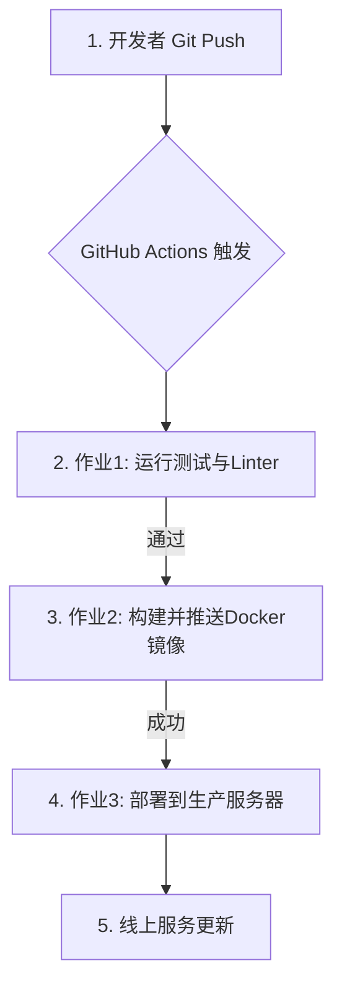

# 01.9 自动化部署：从Git Push到线上服务5分钟搞定

**作者**: Cline | **发布日期**: 2025-10-25 | **分类**: `核心技术栈` `CI/CD` `DevOps` `GitHub Actions`

**摘要**: 现代DevOps文化的核心目标之一，就是让软件部署变得频繁、快速、可靠，甚至“无聊”。告别手动FTP上传或SSH登录服务器执行命令的原始时代吧！本篇教程将为您提供一套完整的、端到端的解决方案，使用GitHub Actions这一强大的CI/CD工具，构建一个全自动化的部署流水线。我们将实现一个理想的场景：当你将代码`git push`到主分支后，系统会自动运行测试、构建Docker镜像、并将其安全地部署到你的生产服务器上——整个过程在5分钟内完成，无需任何人工干预。

**SEO关键词**: 自动化部署, CI/CD, GitHub Actions, Docker部署, 持续集成, 持续部署, DevOps教程, SSH部署

---

## 第1部分：自动化部署的核心理念与组件

### 1.1 CI/CD：现代软件开发的“高速公路”

- **CI (Continuous Integration, 持续集成)**: 这是一种开发实践，鼓励开发者频繁地（每天多次）将代码变更合并到中央代码仓库。每次合并后，系统会自动执行**构建**和**单元测试**，以尽快发现集成错误。

- **CD (Continuous Deployment, 持续部署)**: 这是CI的延伸。一旦代码通过了所有CI阶段（构建、测试），它就会被**自动地**部署到生产环境，交付给最终用户。我们今天构建的，就是一个完整的CI/CD流程。

### 1.2 我们的自动化部署流水线

我们将构建的流水线包含以下阶段：



### 1.3 我们的工具箱

- **代码托管**: GitHub
- **CI/CD平台**: GitHub Actions (免费，与GitHub无缝集成)
- **应用打包**: Docker (将我们的应用容器化)
- **镜像仓库**: Docker Hub (或GitHub Container Registry)
- **部署目标**: 一台云服务器 (VPS, 例如DigitalOcean Droplet)
- **密钥管理**: GitHub Encrypted Secrets

---

## 第2部分：准备工作：配置服务器与GitHub

在编写任何工作流代码之前，我们需要先打通GitHub Actions与生产服务器之间的“安全通道”。

### 2.1 生产服务器端配置

1.  **创建专用的部署用户**: 出于安全考虑，我们绝不直接使用`root`用户进行部署。
    ```bash
    # 在你的生产服务器上执行
    sudo adduser deployer
    sudo usermod -aG docker deployer # 将deployer用户添加到docker组，使其能执行docker命令
    ```

2.  **安装Docker和Docker Compose**: 确保你的服务器上已安装这两个核心工具。

3.  **生成SSH密钥对**: 我们将为GitHub Actions生成一个专属的、无密码的SSH密钥。
    ```bash
    # 以deployer用户身份登录服务器后执行
    ssh-keygen -t rsa -b 4096 -C "github-actions-deploy-key" -f ~/.ssh/github_actions_key -N ""
    
    # 将公钥添加到授权列表中
    cat ~/.ssh/github_actions_key.pub >> ~/.ssh/authorized_keys
    
    # 确保权限正确
    chmod 600 ~/.ssh/authorized_keys
    ```

4.  **获取私钥**: 执行`cat ~/.ssh/github_actions_key`，复制输出的**私钥**内容。我们稍后会用到它。

### 2.2 GitHub仓库端配置

1.  **创建代码仓库**: 在GitHub上创建一个私有或公开的仓库。

2.  **配置加密密钥 (Encrypted Secrets)**: 这是GitHub Actions安全传递敏感信息的唯一正确方式。进入你的仓库页面 -> `Settings` -> `Secrets and variables` -> `Actions`。

3.  点击`New repository secret`，添加以下密钥：
    - `PROD_SERVER_HOST`: 你生产服务器的IP地址。
    - `PROD_SERVER_USERNAME`: 我们刚刚创建的部署用户名，即`deployer`。
    - `PROD_SERVER_SSH_KEY`: 粘贴你在上一步中从服务器复制的**私钥**内容。
    - `DOCKERHUB_USERNAME`: 你的Docker Hub用户名。
    - `DOCKERHUB_TOKEN`: 你的Docker Hub访问令牌（在Docker Hub的`Account Settings` -> `Security`中创建）。

---

## 第3部分：构建CI流水线：测试与构建

现在，我们在项目根目录创建`.github/workflows/main.yml`文件，并编写CI部分的作业。

```yaml
# .github/workflows/main.yml

name: Main CI/CD Pipeline

# 触发条件：当有代码推送到main分支时
on:
  push:
    branches:
      - main

jobs:
  # --- 作业1: 运行测试和代码规范检查 ---
  test_and_lint:
    name: Test and Lint
    runs-on: ubuntu-latest
    steps:
      - name: Checkout code
        uses: actions/checkout@v3

      - name: Set up Node.js
        uses: actions/setup-node@v3
        with:
          node-version: '18'

      - name: Install dependencies
        run: npm install

      - name: Run linter
        run: npm run lint

      - name: Run tests
        run: npm test

  # --- 作业2: 构建并推送Docker镜像 ---
  build_and_push_image:
    name: Build and Push Docker Image
    runs-on: ubuntu-latest
    needs: test_and_lint # 依赖于上一个作业的成功
    steps:
      - name: Checkout code
        uses: actions/checkout@v3

      - name: Set up Docker Buildx
        uses: docker/setup-buildx-action@v2

      - name: Login to Docker Hub
        uses: docker/login-action@v2
        with:
          username: ${{ secrets.DOCKERHUB_USERNAME }}
          password: ${{ secrets.DOCKERHUB_TOKEN }}

      - name: Build and push Docker image
        uses: docker/build-push-action@v4
        with:
          context: . # 使用当前目录作为构建上下文
          file: ./Dockerfile # 指定Dockerfile路径
          push: true # 推送到仓库
          # 使用Git的SHA作为镜像标签，保证版本的唯一性
          tags: your-docker-repo/my-app:${{ github.sha }}
          # 开启构建缓存，加速后续构建
          cache-from: type=gha
          cache-to: type=gha,mode=max
```

**解读**: 
- `test_and_lint`作业确保了所有进入`main`分支的代码都必须是高质量、通过测试的。
- `build_and_push_image`作业使用了一个唯一的、不可变的标签`${{ github.sha }}`来标记镜像，这是版本控制的最佳实践。它还利用了GitHub Actions的缓存来加速未来的镜像构建。

---

## 第4部分：构建CD流水线：自动化部署

这是将我们的应用真正部署上线的最后一步。

### 4.1 生产服务器上的`docker-compose.yml`

首先，在你的生产服务器上（例如`/home/deployer/my-app`目录），需要有一个用于生产环境的`docker-compose.yml`文件。它的关键在于，镜像的标签是**通过一个环境变量来动态指定的**。

```yaml
# /home/deployer/my-app/docker-compose.yml
version: '3.8'

services:
  my_app_service:
    # 镜像标签从环境变量APP_IMAGE_TAG中读取，如果变量不存在，则默认为latest
    image: your-docker-repo/my-app:${APP_IMAGE_TAG:-latest}
    container_name: my_app_prod
    restart: unless-stopped
    ports:
      - "3000:3000"
    # ... 其他生产环境配置，如网络、卷等
```

### 4.2 GitHub Actions中的部署作业

现在，我们在`main.yml`文件中添加最后一个作业。

```yaml
# .github/workflows/main.yml (续)

  # --- 作业3: 部署到生产环境 ---
  deploy_to_production:
    name: Deploy to Production
    runs-on: ubuntu-latest
    needs: build_and_push_image # 依赖于镜像构建推送成功

    steps:
      - name: Deploy to server via SSH
        uses: appleboy/ssh-action@master
        with:
          host: ${{ secrets.PROD_SERVER_HOST }}
          username: ${{ secrets.PROD_SERVER_USERNAME }}
          key: ${{ secrets.PROD_SERVER_SSH_KEY }}
          script: |
            # 以下脚本将在你的生产服务器上执行
            set -e # 确保任何命令失败都会使整个脚本失败

            echo "🚀 Starting deployment..."

            # 导航到应用目录
            cd /home/deployer/my-app

            # 将GitHub Actions中的Git SHA作为环境变量导出
            export APP_IMAGE_TAG=${{ github.sha }}

            echo "🐳 Pulling new image: your-docker-repo/my-app:${APP_IMAGE_TAG}"
            # 使用docker-compose拉取在compose文件中定义的新版本镜像
            docker-compose pull my_app_service

            echo "🚀 Redeploying service..."
            # 使用docker-compose up来平滑地重启服务
            # --no-deps: 不重启依赖的服务（如数据库）
            # --force-recreate: 强制重新创建容器，而不是试图修改现有容器
            # -d: 在后台运行
            docker-compose up -d --no-deps --force-recreate my_app_service

            echo "🧹 Pruning old images..."
            # 清理掉旧的、未被使用的Docker镜像，节省磁盘空间
            docker image prune -f

            echo "✅ Deployment successful!"
```

**工作流程**: 当这个作业运行时，`ssh-action`会登录到你的服务器，将`github.sha`设置为环境变量`APP_IMAGE_TAG`，然后`docker-compose`会读取这个变量，拉取并启动带有正确标签的新镜像，完成一次优雅的滚动更新。

---

## 第5部分：零停机部署与回滚策略

### 5.1 走向零停机：蓝绿部署思路

上述`docker-compose up`的部署方式，在停止旧容器和启动新容器之间，会存在一个短暂的服务中断（通常是几秒钟）。对于大多数项目这可以接受，但对于要求更高的服务，我们可以实现简单的“蓝绿部署”。

- **原理**: 不直接替换正在运行的容器，而是启动一个新版本的容器（例如`my-app-blue`），在另一个端口上运行。当确认新容器健康后，再修改Nginx等反向代理的配置，将流量指向新容器的端口。最后再安全地关闭旧容器。这能实现真正的零停机。
- **实现**: 这需要更复杂的部署脚本，在脚本中动态地修改Nginx配置文件并执行`nginx -s reload`。

### 5.2 快速回滚

自动化部署也让回滚变得极其简单。

- **方法**: 如果你发现`main`分支的最新commit引入了一个严重Bug，你无需登录服务器做任何操作。只需在GitHub的仓库主页，找到上一个成功的commit，然后进入该commit的Actions运行页面，会有一个“Re-run all jobs”的按钮。点击它，GitHub Actions就会使用**旧的commit SHA**，重新走一遍完整的CI/CD流程，将上一个稳定版本的镜像再次部署到生产环境，从而完成回滚。

## 结论

自动化是现代DevOps的灵魂，也是确保部署质量、提升开发幸福感的关键。通过将GitHub Actions与Docker的强大功能相结合，我们可以构建一个强大、可靠、且几乎免费的CI/CD流水线，将繁琐、易错的手动部署，转变为一个安全、可重复、一键触发的“非事件”。从现在开始，让你的每一次`git push`都成为一次充满信心的发布，而不是一次令人焦虑的冒险。

## 参考资料

1.  [GitHub Actions Documentation](https://docs.github.com/en/actions)
2.  [Docker Actions on GitHub Marketplace](https://github.com/marketplace/actions/build-and-push-docker-images)
3.  [SSH Action on GitHub Marketplace](https://github.com/marketplace/actions/ssh-remote-commands)
4.  [DigitalOcean: How To Set Up a Continuous Deployment Pipeline with Docker and GitHub Actions](https://www.digitalocean.com/community/tutorials/how-to-set-up-a-continuous-deployment-pipeline-with-docker-and-github-actions-on-ubuntu-20-04)
