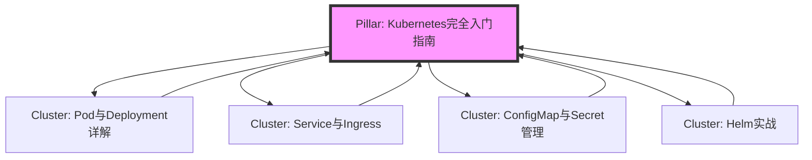

# 03.3 技术内容SEO优化实战（AI时代的新规则）

> SEO已死？不，它只是进化了。在AI生成内容（AIGC）泛滥的今天，传统的关键词堆砌策略早已失效。谷歌和百度等搜索引擎的算法变得空前智能，它们更青睐那些能提供真实“经验”、彰显“专业”、建立“权威”并值得“信赖”的内容（E-E-A-T原则）。本篇教程将为你揭示AI时代下，技术内容创作者如何利用新规则和新工具，让你的文章在搜索结果中脱颖而出。

**学习目标**:
- 掌握面向开发者的关键词研究方法。
- 理解并实践Google的E-E-A-T（经验、专业、权威、可信）原则。
- 学会利用AI工具（如Gemini, ChatGPT）辅助SEO，而非被其取代。
- 掌握技术SEO的核心要素，如结构化数据和网站速度优化。
- 能够构建“主题集群”，成为特定技术领域的权威。

---

## 第1部分：永不过时的SEO基石

无论算法如何变，SEO的一些基本盘永远不会过时。对于技术内容而言，这意味着精准地捕捉开发者的搜索意图。

### 1.1 面向开发者的关键词研究

忘记那些宽泛的商业关键词，开发者的搜索行为极其具体，通常基于以下几种意图：

1.  **问题解决型**: 当遇到bug或具体问题时。这是最常见的搜索类型。
    - 例子: `docker container keeps restarting exit code 1`, `python TypeError: 'NoneType' is not iterable`
2.  **学习概念型**: 希望理解某个技术或概念。
    - 例子: `what is serverless architecture`, `how does kubernetes work`
3.  **方案对比型**: 在不同技术选型之间做决策。
    - 例子: `FastAPI vs Flask performance`, `GCP vs AWS vs Azure cost comparison`
4.  **教程指南型**: 希望获得一步一步的操作指导。
    - 例子: `how to build a CI/CD pipeline with GitLab`, `Next.js 14 tutorial for beginners`

**关键词研究工具**:
- **专业工具**: Ahrefs, SEMrush (价格昂贵，但功能强大)
- **免费工具**:
    - **Google Keyword Planner**: 需要一个Google Ads账号，可以查看搜索量。
    - **AnswerThePublic**: 以可视化的方式展示用户围绕一个核心词提出的各种问题。
    - **Google/Baidu搜索框自动补全和“相关搜索”**: 最直接地反映了真实用户的搜索习惯。

**实战演练：关键词矩阵**

| 搜索意图 | 核心关键词 | 长尾关键词 (Long-tail Keywords) | 文章标题思路 |
| :--- | :--- | :--- | :--- |
| 问题解决 | `Nginx 502` | `nginx 502 bad gateway php-fpm`, `docker nginx 502 upstream sent invalid header` | Nginx 502错误终极排查指南（附真实案例） |
| 学习概念 | `Microservices` | `microservices communication patterns`, `when to use microservices architecture` | 微服务架构深度解析：从入门到放弃？ |
| 方案对比 | `React vs Vue` | `react vs vue performance 2025`, `should I learn react or vue in 2025` | 2025年，React与Vue的终极对决 |
| 教程指南 | `Dockerize App` | `how to dockerize a node.js application`, `docker multi-stage build best practices` | 手把手教你用Docker打包一个Node.js应用 |

### 1.2 核心On-Page SEO清单

1.  **`<title>`标签**: 搜索结果中蓝色的主标题，是SEO最重要的元素。
    - **公式**: `核心关键词 | 吸引人的点 | 你的品牌`
    - **例子**: `Docker多阶段构建实战 | 镜像体积减少80%的秘诀 | 极客小黑`

2.  **Meta Description**: 搜索结果中标题下方的描述文字。它不直接影响排名，但**极大影响点击率**。
    - **要点**: 150-160字符内，包含关键词，像广告语一样吸引用户点击。

3.  **URL结构 (Slug)**:
    - **要点**: 简短、易读、包含核心关键词。
    - **优**: `/docker-multi-stage-build-guide`
    - **劣**: `/p=123` 或 `/2025/10/23/a-guide-about-how-to-use-docker-multi-stage-build`

4.  **标题层级 (H1, H2, H3)**:
    - **H1**: 每页只能有一个，即文章主标题。
    - **H2, H3**: 用于组织文章结构，让内容逻辑清晰。搜索引擎会通过它们来理解文章大纲。

5.  **内部链接 (Internal Links)**:
    - **作用**: 在你的文章之间建立联系，引导用户和爬虫发现更多内容，传递权重。
    - **实践**: 在写A文章时，如果提到B文章的概念，就链接到B文章。

6.  **外部链接 (External Links)**:
    - **作用**: 链接到权威、相关的外部网站（如官方文档、知名技术博客），可以增加你文章的可信度。

7.  **图片Alt文本**:
    - **作用**: 当图片无法加载时显示的文字，也是搜索引擎理解图片内容的方式。
    - **例子**: ``

---

## 第2部分：AI时代的新规则：拥抱E-E-A-T

Google在评估内容质量时，极其看重**E-E-A-T**，这对于技术内容尤其重要。
- **Experience (经验)**: 你真的做过这件事吗？
- **Expertise (专业)**: 你对这个领域了解多深？
- **Authoritativeness (权威)**: 你是这个领域的专家吗？
- **Trustworthiness (可信)**: 你的内容可靠吗？

### 2.1 如何在技术文章中注入E-E-A-T

**1. 展示“经验” (Experience):**
- **分享真实失败案例**: 不要只写“Hello World”的成功路径。分享你遇到的错误、你是如何排查的，附上真实的错误日志截图。这比任何空洞的理论都更有价值。
- **使用原创的图表和截图**: 避免使用网络上的通用图片。自己画架构图（推荐Excalidraw, Mermaid.js），自己截取代码和命令行输出。
- **提供可运行的GitHub仓库**: 将文章中涉及的代码整理成一个完整的项目，并链接到GitHub。这是证明你“真的做过”的最强证据。

**2. 彰显“专业” (Expertise):**
- **深入原理**: 不仅要说明“怎么做”，更要解释“为什么这么做”。例如，解释Docker多阶段构建为何能减小体积（利用了镜像分层和构建缓存）。
- **进行性能对比**: 提供Benchmark数据。例如，对比不同数据库连接池的性能，并用图表展示。
- **引用官方文档**: 在关键概念上链接到官方文档，表明你的知识来源可靠。

**3. 建立“权威” (Authoritativeness):**
- **完善作者简介**: 在每篇文章末尾或网站侧边栏，提供详细的作者介绍（你的职位、技术栈、GitHub/LinkedIn链接）。
- **构建主题集群 (Topic Clusters)**: 见下文详述。
- **在社区发声**: 在Stack Overflow回答问题，在GitHub提交PR，这些都能间接提升你的权威性。

**4. 保证“可信” (Trustworthiness):**
- **保持内容更新**: 技术日新月异。定期回顾并更新你的旧文章，注明“更新于2025年10月”。
- **公开勘误**: 如果文章有错误被读者指出，大方承认并修正。
- **清晰的网站设计**: 专业的网站外观、无侵入性广告、HTTPS加密，这些都会增加用户的信任感。

### 2.2 构建主题集群，成为领域权威

**主题集群 (Topic Cluster)** 是一种强大的SEO策略，它告诉搜索引擎：“我不仅了解这个点，我了解这个领域。”

- **Pillar Page (支柱页面)**: 一篇非常长、非常全面的“终极指南”式文章，覆盖一个广泛的主题。例如，“Kubernetes完全入门指南”。
- **Cluster Content (集群内容)**: 围绕支柱页面的多个子主题写的具体、深入的文章。例如，“Kubernetes的Pod与Deployment详解”、“深入理解Kubernetes网络模型”、“Helm包管理实战”。
- **链接策略**: 所有的“集群内容”都链接回“支柱页面”，同时“支柱页面”也链接到各个“集群内容”。

**使用Mermaid.js可视化主题集群:**

这种结构一旦形成，搜索引擎会认为你是“Kubernetes”领域的权威，从而提升该主题下所有文章的排名。

---

## 第3部分：AI辅助下的SEO工作流

AI不会取代你，但会使用AI的开发者会取代你。

### 3.1 使用LLM进行关键词研究和创意生成

**Prompt 1: 生成长尾关键词**
```
Act as a senior SEO strategist for a tech blog targeting mid-level software engineers. I'm writing an article about "database indexing". Generate a table of 20 long-tail keywords, grouped by user intent (e.g., "what is", "how to", "best practices", "comparison", "troubleshooting").
```

**Prompt 2: 创建E-E-A-T优化的大纲**
```
I want to write an article titled "A Practical Guide to Database Indexing". Create a detailed, E-E-A-T-focused outline. The outline must include:
1. A section explaining the "why" with an analogy.
2. A section with hands-on SQL code examples for creating different index types (B-Tree, Hash).
3. A "common pitfalls" section based on real-world experience, like indexing foreign keys or over-indexing.
4. A section with a performance benchmark (a table showing query times with and without an index).
5. A call to action to a related GitHub repository.
```

### 3.2 使用AI优化On-Page元素

**Prompt 3: 优化标题和Meta描述**
```
My article's working title is "How to use database indexes". It's boring.
Here is a summary of the article: [粘贴你的文章摘要].

Generate 10 click-worthy, SEO-friendly alternative titles. They must include the keyword "database index".
Also, write 3 compelling meta descriptions (under 160 characters) for the best title.
```

### 3.3 使用AI进行内容扩充和润色（而非创作）

**警告**: 直接让AI写完整篇文章是SEO大忌。AI生成的内容往往缺乏“经验”（Experience），容易被识别为低质量内容。

**正确用法**:
- **解释代码**: `Act as a senior developer. Here is a Python function. Add detailed, line-by-line comments explaining its logic, time complexity, and potential edge cases.`
- **简化概念**: `Explain the concept of "CAP Theorem" in simple terms, using an analogy of a pizza delivery service.`
- **内容改写**: `Rewrite this paragraph to be more engaging and active voice: [粘贴你的段落]`

---

## 第4部分：技术SEO实战

技术SEO确保搜索引擎能高效地发现、抓取和理解你的网站。

### 4.1 网站速度 (Core Web Vitals)

速度是排名因素。没人愿意等待一个加载3秒以上的网页。
- **工具**: [Google PageSpeed Insights](https://pagespeed.web.dev/)
- **优化三板斧**:
    1.  **图片优化**: 使用`.webp`格式，通过[TinyPNG](https://tinypng.com/)等工具压缩。
    2.  **启用缓存**: 配置浏览器缓存，让回头客加载更快。
    3.  **使用CDN**: [Cloudflare](https://www.cloudflare.com/)的免费计划就能让你的网站在全球范围内加速。

### 4.2 结构化数据 (Schema Markup)

结构化数据是用一种标准化的格式（如JSON-LD）来描述你页面内容的“元信息”。它能帮助搜索引擎理解你的内容，并可能在搜索结果中展示为“富文本摘要”（Rich Snippets），极大提高点击率。

**为技术文章添加`TechArticle` Schema**:

在你的文章HTML的`<head>`部分或`<body>`底部，插入以下JSON-LD脚本：

```html
<script type="application/ld+json">
{
  "@context": "https://schema.org",
  "@type": "TechArticle",
  "headline": "Docker多阶段构建实战：镜像体积减少80%的秘诀",
  "description": "本教程通过实战案例，教你如何利用Docker的多阶段构建特性，将Node.js应用的镜像体积从1GB优化到200MB。",
  "image": "https://your-blog.com/images/docker-multi-stage.webp",
  "author": {
    "@type": "Person",
    "name": "你的名字",
    "url": "https://your-blog.com/about"
  },
  "datePublished": "2025-10-23",
  "dateModified": "2025-10-23",
  "publisher": {
    "@type": "Organization",
    "name": "你的博客名",
    "logo": {
      "@type": "ImageObject",
      "url": "https://your-blog.com/logo.png"
    }
  },
  "mainEntityOfPage": {
    "@type": "WebPage",
    "@id": "https://your-blog.com/docker-multi-stage-build-guide"
  },
  "proficiencyLevel": "Beginner",
  "technicalAudience": {
    "@type": "EducationalAudience",
    "educationalRole": "Software Developer"
  }
}
</script>
```
这个小小的代码片段，向Google清晰地传达了文章的标题、作者、发布日期、技术受众等关键信息。

### 4.3 `robots.txt` 和 `sitemap.xml`

- **`robots.txt`**: 告诉爬虫哪些页面**不要**抓取。例如，后台登录页面、用户私有页面。
  ```
  # /public/robots.txt
  User-agent: *
  Allow: /
  
  Sitemap: https://your-blog.com/sitemap.xml
  
  Disallow: /admin/
  Disallow: /private/
  ```
- **`sitemap.xml`**: 你网站的“地图”，告诉爬虫你有哪些页面希望被收录。大多数博客框架（Next.js, Hugo, Hexo）都有插件可以自动生成。

---

## 结论

AI时代的SEO，是一场从“欺骗机器”到“取悦人类与机器”的进化。作为技术创作者，你的核心优势在于你的真实经验和专业深度。

**行动清单**:
1.  **以E-E-A-T为北极星**: 在动笔前，思考如何注入你的真实经验。
2.  **从解决问题出发**: 你的下一篇文章，应该解决一个你最近遇到的真实技术难题。
3.  **拥抱AI作为助手**: 让AI帮你做重复性工作，把你的精力聚焦在创造独特价值上。
4.  **完善技术SEO**: 确保你的网站对爬虫友好，加上结构化数据，让你的优质内容能被轻松发现。

现在，去Google Search Console看看你的哪个页面最有潜力，从优化它开始吧！

## 参考资料
- [Google E-E-A-T and Quality Rater Guidelines](https://developers.google.com/search/docs/fundamentals/creating-helpful-content)
- [Schema.org for TechArticle](https://schema.org/TechArticle)
- [Ahrefs Blog (Industry-leading SEO Blog)](https://ahrefs.com/blog/)
- [Excalidraw (For creating hand-drawn style diagrams)](https://excalidraw.com/)
