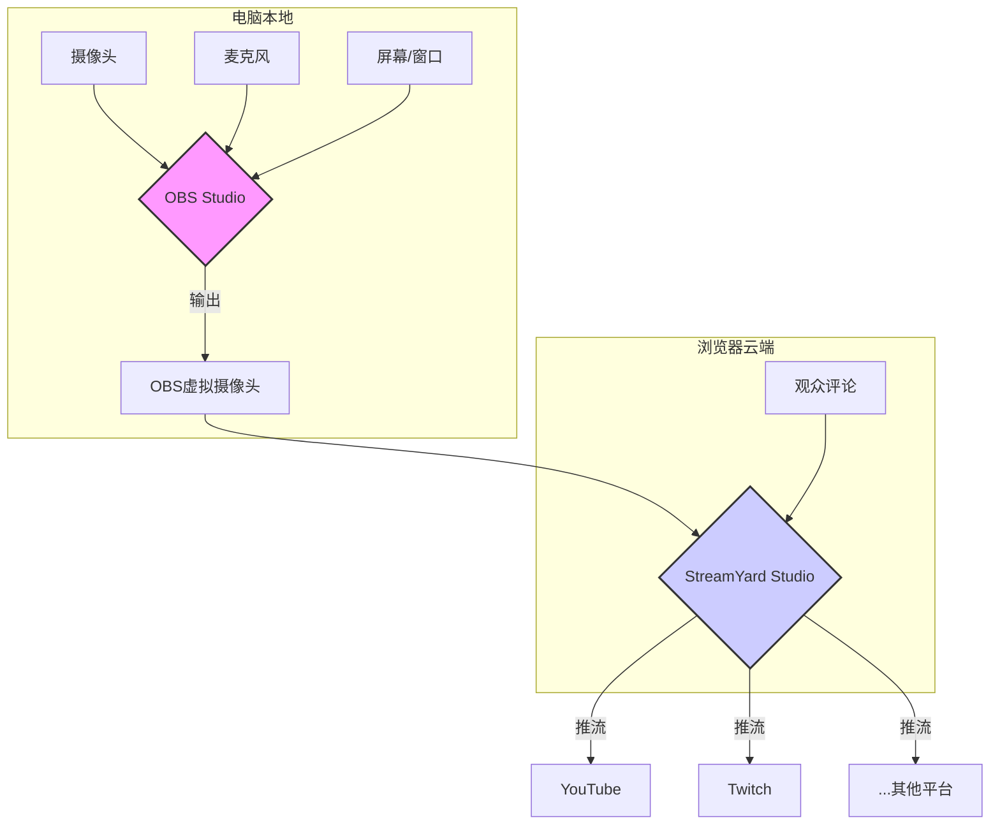

# 03.6 技术直播实战：OBS与StreamYard打造专业直播间

> 如果说录播视频是精心编排的戏剧，那么技术直播就是一场引人入胜的即兴表演。直播能让你与观众进行实时、双向的互动，建立起录播视频无法比拟的社群凝聚力。观众不仅能看到你如何编码，更能看到你如何思考、如何调试、如何解决意料之外的问题。这种真实性，是打造个人品牌的强大武器。本教程将带你从零开始，掌握技术直播的两大核心工具——OBS Studio和StreamYard，并教你如何将它们组合，以最低成本打造一个专业、高互动性的直播间。

**学习目标**:
- 理解技术直播的核心价值与不同平台的选择。
- 掌握OBS Studio的核心概念，并能配置出专业级的直播场景。
- 熟练使用StreamYard进行简单的、高互动性的直播。
- 学会使用OBS虚拟摄像头结合StreamYard的“Pro”级工作流。
- 掌握一套完整的直播前、中、后检查清单，确保每次直播顺利进行。

---

## 第1部分：直播平台与工具链选择

### 1.1 直播平台：你的舞台在哪里？

- **YouTube Live**: 全球最大的视频平台，受众最广。非常适合公开的技术分享、教程和产品发布。VOD（直播录像）会永久保存，成为你频道的长期内容资产。
- **Twitch**: 游戏直播起家，但其“Software and Game Development”分类日益壮大。社区文化更强，互动更即时（通过聊天和表情），适合进行长时间的Live Coding和更具娱乐性的内容。
- **Bilibili (哔哩哔哩)**: 面向中国大陆观众的首选。用户年轻，互动氛围浓厚，弹幕文化是其核心特色。
- **LinkedIn Live**: 偏向专业和商业内容，适合进行行业分析、嘉宾访谈等，能有效触达你的职场人脉。

**建议**: 初期选择一个你最熟悉或目标受众最集中的平台。后期可以通过多平台推流工具（如StreamYard）同时在多个平台直播。

### 1.2 直播工具链：OBS vs. StreamYard

这是技术直播最核心的两个工具，但它们定位不同。

- **OBS Studio (Open Broadcaster Software)**: **你的本地导播台**
    - **优点**: 完全免费、开源、功能极其强大。你可以完全控制画面的每一个像素，自定义复杂的场景、转场和特效。
    - **缺点**: 学习曲线陡峭，对CPU消耗较大，设置繁琐。
    - **适用场景**: 单人直播，追求高度定制化的视觉效果。

- **StreamYard**: **你的云端演播室**
    - **优点**: 极其简单，基于浏览器，无需安装。能轻松实现多人连麦、多平台推流、在画面上展示观众评论等高互动性功能。
    - **缺点**: 免费版功能受限（有StreamYard水印），专业版需要付费订阅。自定义程度远不如OBS。
    - **适用场景**: 访谈、圆桌讨论，或者希望最大程度简化技术设置，专注于内容的创作者。

### 1.3 终极方案：OBS + StreamYard 混合模式

有没有办法既拥有OBS的强大画面定制能力，又享受StreamYard的便捷互动功能？答案是肯定的。通过OBS的“虚拟摄像头”功能，我们可以将OBS精心处理过的画面，作为一个“摄像头信号”输入到StreamYard中。**这是本教程将重点介绍的专业级工作流。**

---

## 第2部分：OBS Studio核心配置实战

下载并安装[OBS Studio](https://obsproject.com/)后，我们来搭建技术直播所需的核心场景。

### 2.1 理解核心概念：场景 (Scenes) 与来源 (Sources)

- **场景 (Scene)**: 想象成一个PPT页面或一个电视节目机位。每个场景包含不同的画面布局。例如，“直播开始”、“代码演示”、“嘉宾连线”等。
- **来源 (Source)**: 场景中的具体元素。例如，你的摄像头、你的屏幕、一张图片、一段文字等。

**一个场景可以包含多个来源，一个来源也可以被多个场景复用。**

### 2.2 创建技术直播必备场景

在OBS左下角的“场景”面板中，点击`+`号，创建以下场景：

**场景1: `[直播预热]`**
- **目的**: 在直播正式开始前，给观众一个等待的界面。
- **来源**: 
    1.  `图像`: 一张精心设计的背景图，包含直播主题和你的社交媒体信息。
    2.  `浏览器`: 添加一个网页倒计时器（搜索“Stream Countdown Timer”）。
    3.  `音频输入捕获`: 你的麦克风（默认静音）。
    4.  `媒体源`: 一段循环播放的背景音乐。

**场景2: `[主画面：代码+摄像头]`**
- **目的**: 这是你直播中最常用的场景。
- **来源**:
    1.  `显示器捕获` 或 `窗口捕获`: **优先使用`窗口捕获`**并指定你的IDE（如VS Code），以避免泄露桌面其他内容。
    2.  `视频捕获设备`: 你的摄像头。
        - **美化技巧**: 按住`Alt`键拖动摄像头的边框，可以进行裁剪。右键点击摄像头来源 -> `滤镜` -> `效果滤镜` -> `图像蒙版/混合`，可以应用一个圆形蒙版，让你的摄像头变成圆形。
    3.  `音频输入捕获`: 你的麦克风。

**场景3: `[全屏摄像头]`**
- **目的**: 当你需要脱离代码，直接与观众交流时使用。
- **来源**:
    1.  `视频捕获设备`: 你的摄像头（放大至全屏）。
    2.  `音频输入捕获`: 你的麦克风。

**场景4: `[稍等片刻]` & `[直播结束]`**
- **目的**: 临时离开或结束直播时使用。
- **来源**: 类似`[直播预热]`，但使用不同的背景图和文字。

### 2.3 专业级音频设置

在“音频混合器”中，找到你的麦克风来源，点击齿轮图标 -> `滤镜`。添加以下三个滤镜，顺序很重要：

1.  **噪声抑制 (Noise Suppression)**: 
    - **方法**: RNNoise（质量更高，CPU消耗稍大）。
    - **作用**: 消除背景中的持续性噪音，如风扇声、空调声。

2.  **压缩器 (Compressor)**:
    - **作用**: 减小声音的动态范围。即，让你的大声喊叫变得柔和，让你的轻声细语被听得更清。这能让观众的听感更舒适。
    - **推荐设置**: 比例(Ratio) `4:1`, 阈值(Threshold) `-18dB`, 启动时间(Attack) `6ms`, 释放时间(Release) `60ms`。

3.  **限制器 (Limiter)**:
    - **作用**: 作为最后一道防线，防止声音突然过大（爆麦）而损伤观众的耳朵。
    - **推荐设置**: 阈值(Threshold) `-6dB`。

### 2.4 设置场景切换快捷键

进入`文件` -> `设置` -> `热键`。为你创建的每个场景设置一个独立的快捷键（如`Ctrl+1`, `Ctrl+2`...）。这能让你的直播如行云流水般切换，而无需用鼠标去点选。

---

## 第3部分：StreamYard实战入门

访问[StreamYard](https://streamyard.com/)并用你的Google或YouTube账号登录。

### 3.1 创建与设置直播

1.  **添加目标 (Destinations)**: 在`Destinations`页面，关联你的YouTube, Twitch, LinkedIn等账号。
2.  **创建直播 (Create a Broadcast)**: 选择你的目标平台，输入直播的标题、描述，并可以`安排在稍后 (Schedule for later)`。
3.  **进入直播间 (Enter Studio)**: 这里是你的“后台”。

### 3.2 直播间核心功能

- **布局 (Layouts)**: 右侧的多种布局选项可以让你轻松切换单人、双人、屏幕分享等不同画面组合。
- **评论 (Comments)**: StreamYard的王牌功能。所有平台的观众评论都会汇集于此。你只需单击某条评论，它就会以非常美观的形式展示在直播画面上。
- **横幅 (Banners)**: 创建一些预设的横幅，如“欢迎订阅我的频道！”或“今晚的主题是...”，并可以在直播中一键显示。
- **品牌 (Brand)**: 在付费版中，你可以上传自己的Logo、背景和叠加层，定制直播间的视觉风格。

---

## 第4部分：终极组合：OBS + StreamYard 工作流

现在，我们将结合两者的优点。

**工作流示意图**:

**分步操作指南**:

1.  **在OBS中设置好一切**: 按照第二部分的介绍，创建好你所有想要的精美场景（圆形摄像头、自定义布局、动态背景等），并配置好所有音频滤镜。

2.  **启动OBS虚拟摄像头**: 在OBS主界面的右下角“控件”面板中，点击`启动虚拟摄像头 (Start Virtual Camera)`。此时，OBS会将你当前预览的场景，伪装成一个名叫“OBS Virtual Camera”的系统摄像头。

3.  **进入StreamYard直播间**。

4.  **在StreamYard中选择OBS信号源**: 
    - 在直播间的`摄像头/麦克风 (Cam/Mic)`设置中：
        - **摄像头来源**: 选择 **`OBS Virtual Camera`**。
        - **音频来源**: 选择你的**物理麦克风**（例如Blue Yeti），**不要**选择与OBS相关的任何选项。

5.  **开始直播**: 
    - **你的工作台**: OBS。你所有的场景切换、效果展示，都在OBS中通过快捷键完成。
    - **你的互动台**: StreamYard。你通过StreamYard的界面来观察和展示观众的评论。

通过这个流程，你既能向观众呈现OBS级别的专业画面，又能享受到StreamYard无与伦比的互动和多平台推流便利性。

---

## 第5部分：直播全周期清单

### 直播前
- [ ] **(提前3-5天)** 确定主题和内容大纲。
- [ ] **(提前1-2天)** 在社交媒体上预告直播时间和主题。
- [ ] **(提前1小时)** 重启电脑，关闭所有不必要的软件。
- [ ] **(提前30分钟)** 打开OBS和StreamYard，检查所有场景和来源是否正常。
- [ ] **(提前15分钟)** 进行一次私密直播测试，检查音视频、网络连接是否稳定。
- [ ] **(提前5分钟)** 切换到`[直播预热]`场景，播放背景音乐，准备开始。

### 直播中
- [ ] 开始时，花1-2分钟与观众打招呼，等待更多人进入。
- [ ] 定期（如每15分钟）口头提醒新来的观众今天的主题是什么。
- [ ] **最重要的：与聊天室互动！** 看到问题及时回答，念出观众的名字并感谢他们的支持。
- [ ] 保持精力充沛，即使只有少数观众，也要像在对1000人演讲一样。

### 直播后
- [ ] **(立即)** 在社交媒体上感谢观众的参与，并附上直播录像的链接。
- [ ] **(1-2天内)** 回看录像，找到可以改进的地方。
- [ ] **(可选但强烈推荐)** 从长达数小时的直播录像中，剪辑出1-3个精彩片段（5-10分钟），作为独立的视频发布。这被称为“内容再利用”，能极大地扩充你频道的内容库。

## 结论

技术直播的核心是“真实”与“互动”。不要害怕在直播中犯错，每一次调试都是一次宝贵的公开教学。从简单的StreamYard开始，或者直接挑战OBS，再或者尝试我们介绍的混合模式。无论你选择哪条路，最重要的是开启第一次直播。你的社群正在等待与你实时连接。

## 参考资料
- [OBS Studio 官方网站](https://obsproject.com/)
- [StreamYard 官方网站](https://streamyard.com/)
- [Nerd or Die (专业的直播视觉素材)](https://nerdordie.com/)
- [Stream Countdown Timer (网页倒计时器)](https://countingdownto.com/)
